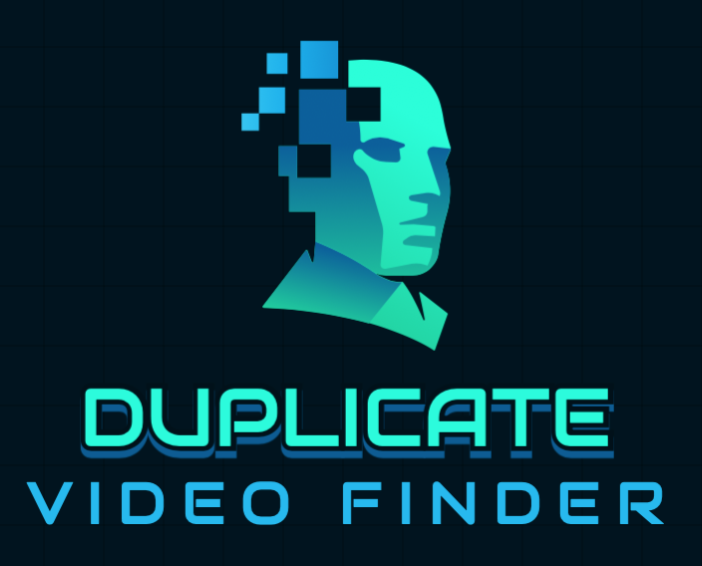
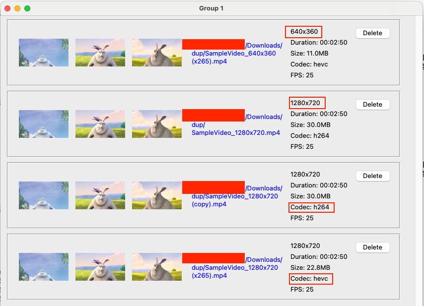

# About




**Video Duplicate Finder** is an open source tool developed in Python 3, designed to identify duplicated video files by analyzing visual similarity. Unlike conventional duplicate detection methods that rely on file hashes or metadata, this software employs image-based comparison algorithms to detect duplicates even when framerate, resolution parameters differ. Leveraging Python’s platform-independent architecture, the software is fully compatible with Windows, Linux, and macOS.

# GUI



# Dependency

1) `ffmpeg` and `ffprobe` binary shall be presented on your system.
2) Python 3 (>=3.10 preferred)
3) `tkinter` for Python GUI. (run `python3 is-tkinter-installed.py` to check)

# Tkinter

Tkinter is included with most standard installs of Python on Linux, Microsoft Windows and macOS, if your distribution doesn't have it you need to install it.

You can either run:

```bash
python3 -m tkinter
```
or in this project folder,

```bash
python3 is-tkinter-installed.py
```

to check the existence of Tkinter.

If you see `ModuleNotFoundError: No module named 'tkinter'`, it’s missing.

# Install

Use Python virtual env to install the dependency in seclusion.

```bash
# Install
cd video-duplicate-finder/
python3 -m venv .env
source .env/bin/activate && pip3 install -r requirements.txt
```

or

```
# Install
make dep
```

# Use

If your `ffmpeg` and `ffprobe` is in the common system path and can be found by Python, just run:

```bash
# Use
cd video-duplicate-finder/
source .env/bin/activate
python3 ./find-dup.py
```
 
# Methodology

Similar videos share some similar properties:
1) Resolution
2) Duration
3) Visually similar screenshots on specific time points.

This tool will capture screenshots and group similar videos, order them by resolution (desc).

# Tools

- `ffmpeg` + `ffprobe`: extract video meta info and do screenshots
- `Pillow`: PIL library to process images.
- `imagehash`: Algorithm to decide image similarities.


# Buy Me a Coffee

No, I am kidding. With the help of AI to do the interface it took me only 1.5 days to finish it.

Feel free to use, update and fork the software.
